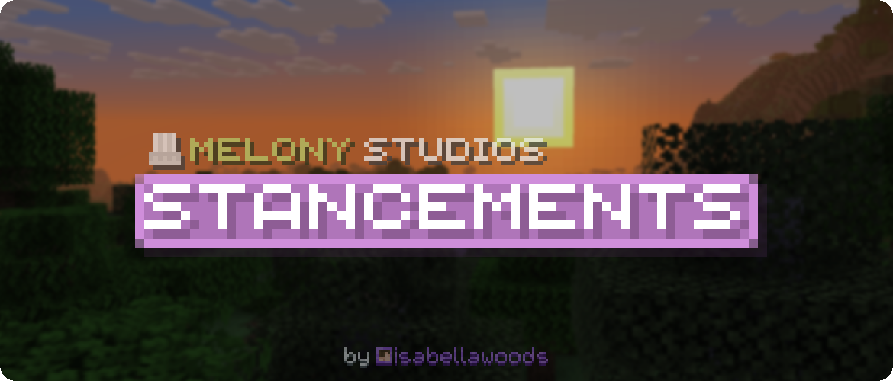

  

*For NeoForge 26.1.2*

***Stancements*** is a mod that adds many miscellaneous but relatively useful features for *Minecraft*.

Many features from this mod were and will be taken from my other mods, since I plan to merge all "slightly useful but not random" features to reduce clutter and increase maintainability.

### Original Mods
This is a list of the mods I've pulled ideas from, including some that I might add in the future:
- ***Melony Additions***: Some blocks, like the missing blocks and *Classic* wool colors will be added with more features;
- ***Melony Lib***: Various feature backports and tags (still need to set a boundary between features for this mod and ***Stackports***);
- ***Decorativelary***: Some blocks, and the pre-existing shelves;
- [***My Other Stuff (Others)***](https://github.com/isabellawoods/My-Other-Stuff): Many random but cool-looking blocks (I really like the new textures I made, and don't want them to go to waste);
- ***JTW Labs***: The crop pots, as that's basically the only feature from that mod.